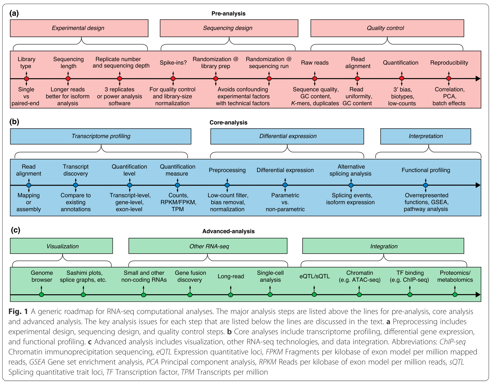
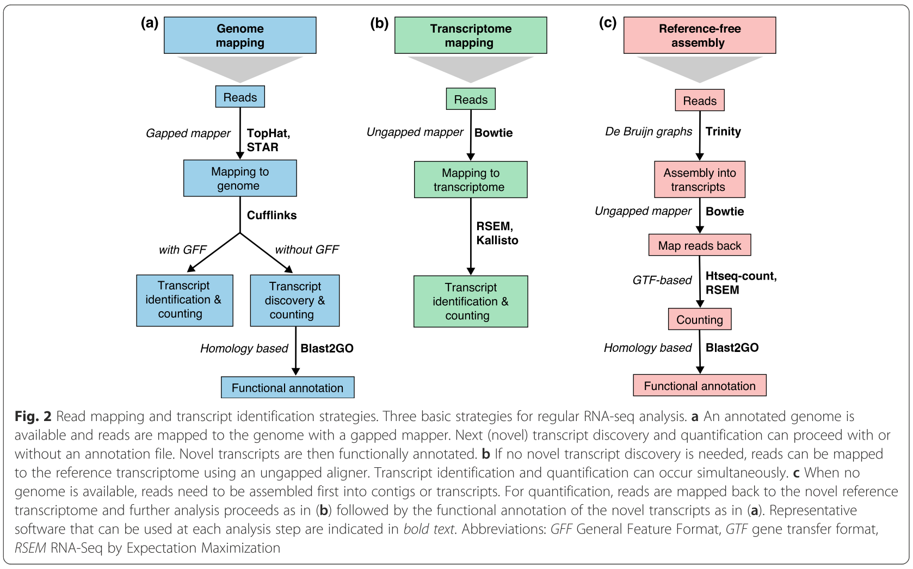

# sctld_jamboree_RNAseq

The RNAseq section of the jamboree will focus on a coral species that do not have a reference genome assembly, *Colpophyllia natans*. Following the routine read QC and trimming steps, we will rely on de novo transcriptome assembly and annotation to create a new reference transcriptome we can use in the analysis of gene expression in control and SCTLD-infected colonies.This short course assumes some familiarity with Unix bash and R languages, but these skills can be supplemented by following the tutorials closely.

The sequencing reads for this experiment were paired-end, 150-bp reads obtained from the Illumina NovaSeq instrument at the University of Miami Center for Genome Technology core facility.

There are 4 healthy coral samples and 3 disease-infected samples included in this analysis. 
K1
K2
K14
K6
K8
K7
K12

## Generic roadmap for RNAseq analyses

There are many options for analyzing RNAseq data, but a good summary of general best practices and recommended workflows can be found in Conesa et al. 2016: https://genomebiology.biomedcentral.com/articles/10.1186/s13059-016-0881-8

The first figure from this paper is below, and the numbers represent the steps we will be aiming to accomplish during this week's sessions. 

1. Read quality control using FastQC and Trimmomatic
2. Transcriptome profiling
  + De novo transcriptome assembly and annotation
  + Transcript quantification
3. Differential expression analysis
4. Interpretation

## General RNAseq resources and software downloads

Although you will not need to download and install all the following tools to complete our analysis of coral disease transcriptomes, we recommend reading the software methods papers even if yoo don't fully grasp every detail:

1. Read quality control
  * FastQC (https://www.bioinformatics.babraham.ac.uk/projects/fastqc/)
  * Trimmomatic (paper: https://academic.oup.com/bioinformatics/article/30/15/2114/2390096, download: http://www.usadellab.org/cms/?page=trimmomatic)
  * TrimGalore! 

2. Transcriptome profiling
  * Trinity for RNAseq de novo assembly: (paper: https://www.ncbi.nlm.nih.gov/pmc/articles/PMC3571712/, manual: https://github.com/trinityrnaseq/trinityrnaseq/wiki)
  * Annotation of de novo transcriptome: https://github.com/z0on/annotatingTranscriptomes
  * BLAST2GO
  * Assess transcriptome completeness: BUSCO
  * STAR (paper: https://www.ncbi.nlm.nih.gov/pmc/articles/PMC3530905/, manual: https://github.com/alexdobin/STAR/blob/master/doc/STARmanual.pdf)
  * Bowtie
  * RSEM
  * featureCounts (paper: https://academic.oup.com/bioinformatics/article/30/7/923/232889, manual: http://subread.sourceforge.net/)

3. Differential expression analysis
  * DESeq2 (paper: https://genomebiology.biomedcentral.com/articles/10.1186/s13059-014-0550-8, vignette: https://www.bioconductor.org/packages/devel/bioc/vignettes/DESeq2/inst/doc/DESeq2.html)

Use these additional tutorials to supplement your knowledge of the specific steps we complete as part of the analysis jamboree:
  * https://chagall.med.cornell.edu/RNASEQcourse/
  * https://hbctraining.github.io/Intro-to-rnaseq-hpc-O2/lessons/03_alignment.html

## Specific steps for analyzing SCTLD transcriptomes

### Quality control with FastQC and MultiQC

### Read trimming with Trimmomatic

### De novo transcriptome assembly with Trinity (*C. natans*)

### Read quantification and counts table generation

### Differential gene expression analysis

This is where the course analyses come in.