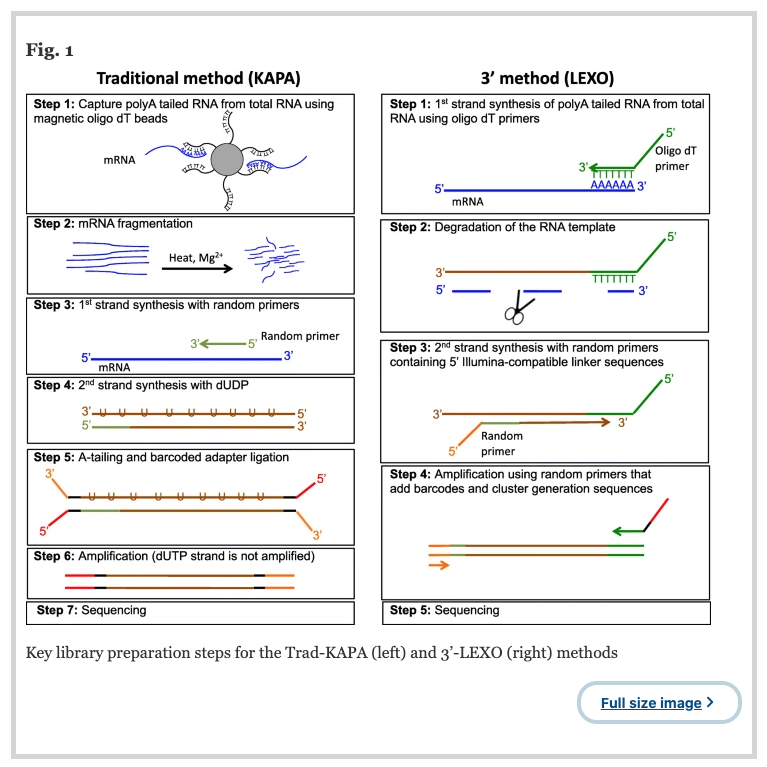

# SCTLD TAG-seq Jamboree  

## Introduction  
### General Overview

Here you will find the scripts and pipeline for the analysis of the TAG-seq (3 prime RNA-seq) analysis of *Orbicella faveolata* and *Montastrea cavernosa*. This workflow assumes basic understanding of Unix bash and R languages, but following tutorials for each step should provide enough background.  

These samples were sequenced on a Nova-seq (at the University of Miami Center for Genome Technology Core Facility) with single-end 100 base pair reads.  

### General RNA-seq analysis Overview  

TAG-seq employs a very similar pipeline to traditional RNA-seq with a few tweaks due to how library prep is performed (see Fig below from Conesa *et al* (2016)). The paper by Conesa *et al* (2016) is still a very good overview for best practices in regards to TAG-seq analysis (https://genomebiology.biomedcentral.com/articles/10.1186/s13059-016-0881-8)

  

### TAG-seq VS RNA-Seq  

I am not going to go into this in depth, but will link resources below if you want to read more into the difference between traditional RNA-seq an TAG-seq.  

The key part to understand is that traditional RNA-seq fragments mRNA and generates cDNA libraries for all these fragments. This means each mRNA molecule can have numerous cDNA molecules generated. TAG-seq does not do this but instead quantifies each mRNA molecule once by attaching at the 3' end of each molecule. This is highlighted in the summary figure below from Ma *et al* (2019).  

  

A big difference betwenn TAG-seq and traditional RNA-seq is that we need an already avaliable genome or well annotated reference transcriptome if we want to do TAG-seq. This is why we are only doing two species (*Orbicella faveolata* and *Montastrea cavernosa*) with TAG-seq as the other species for these samples (*Pseudodiploria clivosa* and *Colophylia natans*) do not have avaliable resources required for analysis.  

    *Montastrea cavernosa*
  Genome resources from the Matz lab: https://matzlab.weebly.com/data--code.html
    
    *Orbicella faveolata*
  Genome resources from the NCBI: https://www.ncbi.nlm.nih.gov/assembly/GCF_002042975.1/  

Useful resources:  

* Comparison of 3' and traditional - https://bmcgenomics.biomedcentral.com/articles/10.1186/s12864-018-5393-3  

* 3' Vs Traditional - https://ucdavis-bioinformatics-training.github.io/2017-June-RNA-Seq-Workshop/wednesday/TagSeqVSRnaSeq.pdf  

* Advantages and disadvantages of 3' - https://dnatech.genomecenter.ucdavis.edu/tag-seq-gene-expression-profiling/  

* Another comparison of 3' and traditional - https://onlinelibrary.wiley.com/doi/full/10.1111/1755-0998.12529  

* Slides for difference between 3' and traditional - https://ucdavis-bioinformatics-training.github.io/2017-June-RNA-Seq-Workshop/wednesday/TagSeqVSRnaSeq.pdf  


### Software Resources  

YOU DO NOT NEED TO DOWNLOAD AND INSTALL ALL OF THESE. They are here for your reference so you can see the steps that we will be taking for this pipeline.  

I would recommend reading through and having a decent grasp of what each program does and where it falls in the TAG-seq pipeline.  

* FastQC  
  + Webpage - https://www.bioinformatics.babraham.ac.uk/projects/fastqc/ 

* BBDuk (part of bbtools - https://jgi.doe.gov/data-and-tools/bbtools/bb-tools-user-guide/)
  + Webpage - https://jgi.doe.gov/data-and-tools/bbtools/bb-tools-user-guide/bbduk-guide/
  
* STAR
  + Paper - https://www.ncbi.nlm.nih.gov/pmc/articles/PMC3530905/
  + Manual - https://physiology.med.cornell.edu/faculty/skrabanek/lab/angsd/lecture_notes/STARmanual.pdf
  + Worked example - https://hbctraining.github.io/Intro-to-rnaseq-hpc-O2/lessons/03_alignment.html

* Salmon
  + Paper - https://www.ncbi.nlm.nih.gov/pmc/articles/PMC5600148/
  + Manual/Vignette - https://salmon.readthedocs.io/en/latest/salmon.html# 

* Tximport
  + Manual - https://bioconductor.org/packages/release/bioc/manuals/tximport/man/tximport.pdf
  + Vignette - https://bioconductor.org/packages/release/bioc/vignettes/tximport/inst/doc/tximport.html

* Differential Expression  (see a blog from Michael Love about which is best - https://mikelove.wordpress.com/2016/09/28/deseq2-or-edger/)
  + DeSeq2
    + Paper - https://genomebiology.biomedcentral.com/articles/10.1186/s13059-014-0550-8
    + Manual - https://bioconductor.org/packages/release/bioc/manuals/DESeq2/man/DESeq2.pdf
    + Vignette - https://bioconductor.org/packages/release/bioc/vignettes/DESeq2/inst/doc/DESeq2.html
  + EdgeR
    + Paper - https://www.ncbi.nlm.nih.gov/pmc/articles/PMC2796818/
    + Manual - http://bioconductor.org/packages/release/bioc/manuals/edgeR/man/edgeR.pdf
    + Vignette - http://bioconductor.org/packages/release/bioc/vignettes/edgeR/inst/doc/edgeRUsersGuide.pdf
  + Limma Voom
    + Paper - https://www.ncbi.nlm.nih.gov/pmc/articles/PMC4402510/
    + Manual - http://bioconductor.org/packages/release/bioc/manuals/limma/man/limma.pdf
    + Vignette - http://bioconductor.org/packages/release/bioc/vignettes/limma/inst/doc/usersguide.pdf  
    

**PLEASE NOTE** there are more resources for all of these out there, these are just some of the best ones in my opinion.  

I also thought it would be useful to have the Pegasus help faq as for large numbers of samples you should not run any of this (apart from the differential expression analysis) on your desktop. 

https://acs-docs.readthedocs.io/pegasus/README.html 

## TAG-seq SCTLD Analysis  

When analyzing 3' RNA-seq there is some slight variations compared to standard RNA-seq. Saying this, they are very small and it is mainly linked to program parameters.  

Luckily, Lexogen provides a resource with the "optimal" settings for trimming and STAR alignment. When doing this analyses it is important to not **reinvent the wheel** so I have adapted my original RNA-seq workflow to incorporate their suggestions ans save myself time and numerous headaches. 

https://www.lexogen.com/quantseq-data-analysis/  


### 1. Sample Mangement  

Once we get our reads back from sequencing we need to do a few things to get them ready for our next pipeline steps. This can depend on your sequencing machine as well as the facility that does it. Below is how I receive them from Bill and the steps I do to prep them.  

N.B you can do this on a supercomputer (to speed up) or on your desktop/laptop. For 20ish samples thats okay but with 300 I would whole heartedly recomend a super computer or a dedicated desktop with large amounts of RAM. 

(screenshot raw reads from Bill)  

#### Step 1. Removing Unwanted in Title

The title has alot of information; PI, project number, HIG ID, sequencing run and file type. I always get rid of the information that is the same for all the samples, so here I remove the PI and project number. 

```bash
# path to raw reads
cd path>to>rawreads

# making variable with all the raw reads in the file we have cd to
SAMPLES=`ls|echo`

# for loop that iterates through all the files stored in the SAMPLE variable, and then runs a sed command 
# which removes the info at the beginning and maintains the important information for subsequent steps
for SAMPLES in *
do
FILES=`echo $SAMPLES | sed 's/nKnowles_TagSeq06012020_\([0-9r]*-01_S_._.\.txt\.bz2\)/\1/'`
echo ${FILES}
mv "${SAMPLES}" "${FILES}"
done
```

This is just a basic for loop in Unix Bash. The sed command is a little more complex but there are alot of good resources you can find googling to help with these. As such I am not going to go into this more. 

#### Step 2. Unzipping Files  

This probably is not necessary, but I was having trouble with a later step if I did not do this. This can take a while if on a desktop or laptop. 

```bash
bzip2 -d -v -k *
```

#### Step 3. Merging Flow Cell Reads  

As mentioned above, each sample has a **S_1_1** or **S_2_1**. All this is is  
* S_1_1 = lane 1 read 1
* S_2_1 = lane 2 read 1  

All we have to do is therfore merge them and then we will have all reads for each sample in one file.  

```bash
# moving into raw read folder
cd path/to/rawread/folder

# variable with all samples in the folder
SAMPLES=`ls|echo`

# for loop that runs through all samples and says to add S_1_1 and S_2_1 together and make a new folder. 
for SAMPLES in *
do
FILES=`echo $SAMPLES | sed 's/\([0-9r]*-01\).*/\1/'`
echo ${FILES}
cat "${FILES}_S_1_1.txt" "${FILES}_S_2_1.txt" > "${FILES}.txt"
done

# deleting all the S_x_1 files 
# N.B you may want to mv these for archiving if you want. 
rm -r *_S_*_1.txt
```

#### Step 4. Renaming to .fastq  

This could realistically be done in the last command when we concatenate and name the new folder. Regardless, this is then how you do this.  

```bash
# moving into raw read folder
cd path/to/rawread/folder

# variable with all samples in the folder
SAMPLES=`ls|echo`

# for loop that takes variable, and then 
for SAMPLES in *
do
FILES=`echo $SAMPLES | cut -f 1 -d '.'`
echo ${FILES}
mv "${SAMPLES}" "${FILES}.fastq"
done
```

#### Step 5. Renaming to more useful sample names  

I submitted these in HIG ID tubes supplied by the squencing facility. As such, they are just a bunch of numbers that can be read by robots for automation. This is not helpful and I like to switch as early as possible so all subsequent files are labelled as our sample information

```bash
# moving into raw read folder
cd path/to/rawread/folder

# awk command to match the HIG ID with our sample name in a mapping csv file made. 
awk -F',' 'system("mv " $1 " " $2)' ~/Desktop/mappingFile.csv
```
  
#### Step 6. Rezipping for Upload to Supercomputer  

I have a dedicated desktop from IT department to do all this so I can leave running in background. As such I just rezip these for upload to superocmputer for a few reasons 
* Smaller files 
* Quicker upload 
* Downstream tools can access bzipped files 

```bash 
# moving into raw read folder
cd path/to/rawread/folder

# bzipping 
bzip -z *
```

  
### 2. Quality Control  

These step is one to make sure your received raw reads are of okay quality, and to allow you to see how you should go about trimming. 

This screenshot shows the outputs I am interested in for FastQC.  

(screenshots tiles of importance)

As we can see, quality decreases as you progress left to right, and we also have a high adapter content as well as some funky sequence content. We will therfore take these into consideration with the trimming step next.  

For in depth info on each tab see: https://rtsf.natsci.msu.edu/genomics/tech-notes/fastqc-tutorial-and-faq/#:~:text=The%20output%20from%20FastQC%2C%20after,or%20%E2%80%9CFail%E2%80%9D%20is%20assigned.

  
### 3. Trimming with BBDuk  

There are multiple tools you can use for trimming but I am now using BBDuk instead of ones like trimmomatic. The reason, its easier and also is part of a whole suite of very useful tools (BBTools). As said previously, I use the recommendations from Lexogen as they know what the best parameters are (https://www.lexogen.com/quantseq-data-analysis/)

```bash
# moving into raw read folder
cd path/to/rawread/folder

# variable with all files saved for the for loop
# the cut removes the .fastq.bz2 and leaves just sample names
PALMATA=`ls | cut -f 1 -d '.'`

# for loop to run through files recursively 
# the \ allows you to separate by line, otherwise this would all be on one line and is ugly as
for PALPAL in $PALMATA
do
bbduk.sh \
-Xmx200m \
in=path/to/rawread.fastq \
out=path/to/trim/folder/trimmed.fastq \
ref=/nethome/bdy8/programs/bbmap/resources/polyA.fa.gz,/nethome/bdy8/programs/bbmap/resources/truseq_rna.fa.gz \
k=13 \
ktrim=r \
useshortkmers=T \
mink=5 \
qtrim=10 \
minlength=20
```

### 4. Alignment with STAR  

Now we have our trimmed reads, we can align them to a reference transcriptome or a genome. For this analysis we have;  
* *Orbicella faveolata* -> https://matzlab.weebly.com/data--code.html
* *Montastrea cavernosa* -> https://www.ncbi.nlm.nih.gov/assembly/GCF_002042975.1/  

This requires two steps  

#### 4.1 Genome Indexing  

We first need to generate a genome index for STAR to align our trimmed reads against. This requires **ALOT** of RAM so this should be done on the supercomputer (I use Pegasus for mine). 

```bash
# generating a gff file with no tRNA in it, these can cause problems downstream
awk '$3 != "tRNA" {print $0}' < \
path/to/genome.gff3 > \
genome_gff3_notrna.gff3

# general genome generate parameters used for Ofav and Mcav
STAR \
--runThreadN 8 \
--runMode genomeGenerate \
--genomeDir /nethome/bdy8/ofav_genome/ \
--genomeFastaFiles path/to/genome.fasta \
--sjdbGTFfile path/to/genome.gff3 \
--sjdbOverhang 100 \ 
--sjdbGTFtagExonParentTranscript Parent
```
  

#### 4.2 Alignment to Indexed Genome  

We now use our generated genome index for alignment to our raw trimmed reads.  

This is also memory intensive and so should be run on a superocmputer or cluster. Again, we are using the recommended parameters from the lexogen data analysis page (https://www.lexogen.com/quantseq-data-analysis/)  

An important flag is `--outSAMtpe`, this ouputs a unsorted BAM file which we need to use for the quantificatio step in salmon. 


```bash
# parameters for Ofav and Mcav alignment
STAR \
--runThreadN 8 \
--genomeDir path/to/genome/index/ \
--readFilesIn path/to/trimmed/reads \
--outFilterType BySJout \
--outFilterMultimapNmax 20 \
--outFilterMismatchNoverLmax 0.1 \
--alignIntronMin 20 \
--alignIntronMax 1000000 \
--alignMatesGapMax 1000000 \
--outSAMtype BAM SortedByCoordinate \
--quantMode TranscriptomeSAM GeneCounts \
--outSAMstrandField intronMotif \
--twopassMode Basic \
--outFilterScoreMinOverLread 0.2 \
--outFilterMatchNminOverLread 0.2 \
--twopass1readsN -1 \
--outReadsUnmapped Fastx \
--outFileNamePrefix path/to/output/folder/ #need a folder for each sample 
```  

  
### 5. Quantification with Salmon  

Now we have our aligned reads we need to quantify them in a way so that we can import them into R and Rstudio for subsequent analysis. Salmon does these 'wicked fast' and generates a quant.sf for each sample that has the counts for each gene in it.  

THE `-l` flag is SUPER IMPORTANT. You need to pay attention to this parameter and the library prep we used. For example, if we used  
* Illumina TruStrand and did single reads - SR  

* Lexogen Quantseq FWD and single reads - SF

```bash
# as we use genome fasta we need to generate a transcriptome for salmon to use
gffread \
-w made_gffread.fasta  \
-g fasta_used_in_genomegenerate_STAR.fasta \
gff_used_in_genomegenerate_STAR.gff3

# general quant job used for Mcav and Ofav
salmon \
quant \
-t made_gffread.fasta \
-l SF \
--fldMean 320 \
--gcBias \
--seqBias \
-a path/to/aligned.bam \
-o path/to/output/folder
```  
  
### 6. Differential Expression Analysis  

Now we have our reads quantified for each sample we can start to visualise and do statistical analysis on our samples. This is **now in R and RStudio** and will be what everyone is doing for the remainder of the Jamboree.  

I will show you how to read in samples using **Tximport** and then we will be following the DeSeq2 vignette from Love *et al* - https://bioconductor.org/packages/release/bioc/vignettes/DESeq2/inst/doc/DESeq2.html


  

  