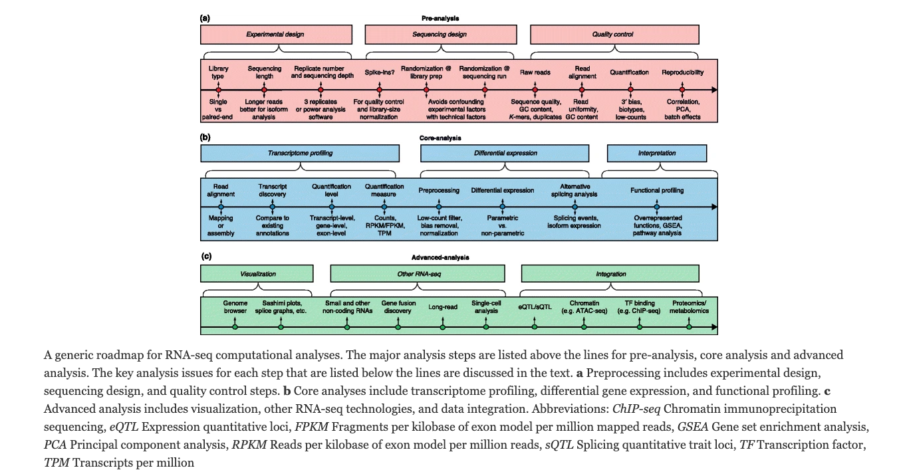

# SCTLD TAG-seq Jamboree  

## Introduction  
### General Overview

Here you will find the scripts and pipeline for the analysis of the TAG-seq (3 prime RNA-seq) analysis of *Orbicella faveolata* and *Montastrea cavernosa*. This workflow assumes basic understanding of Unix bash and R languages, but following tutorials for each step should provide enough background.  

These samples were sequenced on a Nova-seq (at the University of Miami Center for Genome Technology Core Facility) with single-end 100 base pair reads.  

### General RNA-seq analysis Overview  

TAG-seq employs a very similar pipeline to traditional RNA-seq with a few tweaks due to how library prep is performed (see Fig below from Conesa *et al* (2016)). The paper by Conesa *et al* (2016) is still a very good overview for best practices in regards to TAG-seq analysis (https://genomebiology.biomedcentral.com/articles/10.1186/s13059-016-0881-8)

  

### TAG-seq VS RNA-Seq  

I am not going to go into this in depth, but will link resources below if you want to read more into the difference between traditional RNA-seq an TAG-seq.  

The key part to understand is that traditional RNA-seq fragments mRNA and generates cDNA libraries for all these fragments. This means each mRNA molecule can have numerous cDNA molecules generated. TAG-seq does not do this but instead quantifies each mRNA molecule once by attaching at the 3' end of each molecule. This is highlighted in the summary figure below from Ma *et al* (2019).  

  

A big difference betwenn TAG-seq and traditional RNA-seq is that we need an already avaliable genome or well annotated reference transcriptome if we want to do TAG-seq. This is why we are only doing two species (*Orbicella faveolata* and *Montastrea cavernosa*) with TAG-seq as the other species for these samples (*Pseudodiploria clivosa* and *Colophylia natans*) do not have avaliable resources required for analysis.  

    *Montastrea cavernosa*
  Genome resources from the Matz lab: https://matzlab.weebly.com/data--code.html
    
    *Orbicella faveolata*
  Genome resources from the NCBI: https://www.ncbi.nlm.nih.gov/assembly/GCF_002042975.1/  

Useful resources:  

* Comparison of 3' and traditional - https://bmcgenomics.biomedcentral.com/articles/10.1186/s12864-018-5393-3  

* 3' Vs Traditional - https://ucdavis-bioinformatics-training.github.io/2017-June-RNA-Seq-Workshop/wednesday/TagSeqVSRnaSeq.pdf  

* Advantages and disadvantages of 3' - https://dnatech.genomecenter.ucdavis.edu/tag-seq-gene-expression-profiling/  

* Another comparison of 3' and traditional - https://onlinelibrary.wiley.com/doi/full/10.1111/1755-0998.12529  

* Slides for difference between 3' and traditional - https://ucdavis-bioinformatics-training.github.io/2017-June-RNA-Seq-Workshop/wednesday/TagSeqVSRnaSeq.pdf  

### Software Resources  

YOU DO NOT NEED TO DOWNLOAD AND INSTALL ALL OF THESE. They are here for your reference so you can see the steps that we will be taking for this pipeline.  

I would recommend reading through and having a decent grasp of what each program does and where it falls in the TAG-seq pipeline.  

* FastQC  
  + Webpage - https://www.bioinformatics.babraham.ac.uk/projects/fastqc/ 

* BBDuk (part of bbtools - https://jgi.doe.gov/data-and-tools/bbtools/bb-tools-user-guide/)
  + Webpage - https://jgi.doe.gov/data-and-tools/bbtools/bb-tools-user-guide/bbduk-guide/
  
* STAR
  + Paper - https://www.ncbi.nlm.nih.gov/pmc/articles/PMC3530905/
  + Manual - https://physiology.med.cornell.edu/faculty/skrabanek/lab/angsd/lecture_notes/STARmanual.pdf
  + Worked example - https://hbctraining.github.io/Intro-to-rnaseq-hpc-O2/lessons/03_alignment.html

* Salmon
  + Paper - https://www.ncbi.nlm.nih.gov/pmc/articles/PMC5600148/
  + Manual - https://salmon.readthedocs.io/en/latest/salmon.html# 

* Tximport
  + Manual - https://bioconductor.org/packages/release/bioc/manuals/tximport/man/tximport.pdf
  + Vignette - https://bioconductor.org/packages/release/bioc/vignettes/tximport/inst/doc/tximport.html

* Differential Expression  (see a blog from Michael Love about which is best - https://mikelove.wordpress.com/2016/09/28/deseq2-or-edger/)
  + DeSeq2
    + Paper - https://genomebiology.biomedcentral.com/articles/10.1186/s13059-014-0550-8
    + Manual - https://bioconductor.org/packages/release/bioc/manuals/DESeq2/man/DESeq2.pdf
    + Vignette - https://bioconductor.org/packages/release/bioc/vignettes/DESeq2/inst/doc/DESeq2.html
  + EdgeR
    + Paper - https://www.ncbi.nlm.nih.gov/pmc/articles/PMC2796818/
    + Manual - http://bioconductor.org/packages/release/bioc/manuals/edgeR/man/edgeR.pdf
    + Vignette - http://bioconductor.org/packages/release/bioc/vignettes/edgeR/inst/doc/edgeRUsersGuide.pdf
  + Limma Voom
    + Paper - https://www.ncbi.nlm.nih.gov/pmc/articles/PMC4402510/
    + Manual - http://bioconductor.org/packages/release/bioc/manuals/limma/man/limma.pdf
    + Vignette - http://bioconductor.org/packages/release/bioc/vignettes/limma/inst/doc/usersguide.pdf  
    

**PLEASE NOTE** there are more resources for all of these out there, these are just some of the best ones in my opinion. 

## TagSeq
  Scripts for general TagSeq analyses provided by Matz Lab at UT Arlington:
  https://github.com/z0on/tag-based_RNAseq
  

  